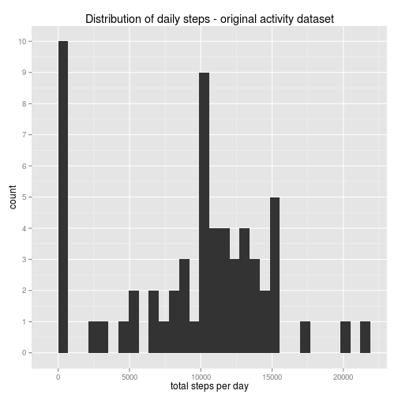
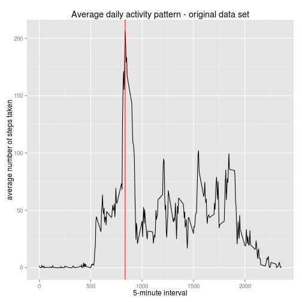
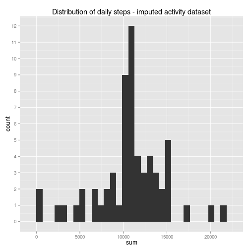
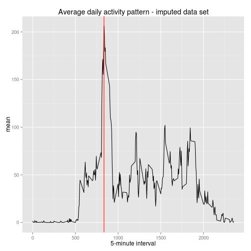
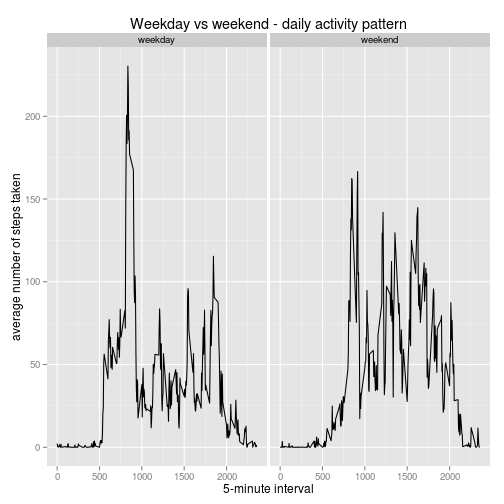

# Reproducible Research: Peer Assessment 1


## Loading and preprocessing the data


```r
# First. get the raw data file, if it doesn't already exist
if (!file.exists("./repdata-data-activity.zip")) {
    fileUrl <- "https://d396qusza40orc.cloudfront.net/repdata%2Fdata%2Factivity.zip"
    download.file(fileUrl, destfile = "./repdata-data-activity.zip", method = "curl")
    # Store the time the file was retrieved
    downloadedAt = format(Sys.time(), "%a %b %d %X %Y")
    save(fileUrl, downloadedAt, file = "FileDetails.RData")
}
# Now read the dataset
activityData <- read.table(unz("./repdata-data-activity.zip", "activity.csv"), 
    sep = ",", stringsAsFactors = F, header = T)
# and the download details
load("FileDetails.RData")

activityData$realDate <- as.Date(activityData$date, format = "%Y-%m-%d")
activityData$realSteps <- as.numeric(activityData$steps)
```


Analysis based on the file https://d396qusza40orc.cloudfront.net/repdata%2Fdata%2Factivity.zip downloaded on Sat Jul 19 10:49:53 2014

## What is mean total number of steps taken per day?


```r
# calculate the total # of steps per day
library("plyr")
# note. ddply throws a spurious error when using a variable defined in a
# different code chunk - try wrapper to suppress
try(activity_summary <- ddply(activityData, ~realDate, summarise, sum = sum(realSteps, 
    na.rm = T)), T)
library("ggplot2")
qplot(sum, data = activity_summary, xlab = "total steps per day", main = "Distribution of daily steps - original activity dataset") + 
    scale_y_continuous(breaks = seq(0, 10, 1))
```

```
## stat_bin: binwidth defaulted to range/30. Use 'binwidth = x' to adjust this.
```

 

```r
# find the mean and median
unadj_mean <- mean(activity_summary$sum)
unadj_median <- median(activity_summary$sum)
# again removing rows with no steps in the day
adj_median <- median(activity_summary$sum[activity_summary$sum > 0])
adj_mean <- mean(activity_summary$sum[activity_summary$sum > 0])
```


The mean number of steps taken per day is 9354.23 and the median number of steps is 10395.00

Removing days with no step data the mean number of steps taken per day is 10766.19 and the median number of steps is 10765.00

## What is the average daily activity pattern?


```r
# calculate the avg steps per interval
interval_avg <- ddply(activityData, ~interval, summarise, mean = mean(realSteps, 
    na.rm = T))
# What's the interval with the maximum number of steps
max_interval <- interval_avg$interval[interval_avg$mean == max(interval_avg$mean)]
qplot(interval, mean, data = interval_avg, geom = "path", xlab = "5-minute interval", 
    ylab = "average number of steps taken", main = "Average daily activity pattern - original data set") + 
    geom_vline(xintercept = max_interval, colour = "red")
```

 


On average, the maximum number of steps are taken in the interval at 835


## Imputing missing values

There are 2304 rows with missing data in the activity data set.

We will create a new dataset that replaces the NA values with the 5 minute mean.


```r
# identify the missing rows
ind <- which(!complete.cases(activityData), arr.ind = TRUE)
newActivityData <- data.frame(activityData$interval, activityData$realDate, 
    activityData$realSteps)
names(newActivityData) <- c("interval", "realDate", "realSteps")
getAvg <- function(idx) {
    # find the average number of steps for the interval
    interval_avg$mean[interval_avg$interval == newActivityData$interval[idx]]
}
# substitute the null value for the average TO DO - replace for loop with
# vectorised impl
for (idx in ind) {
    if (is.na(newActivityData$realSteps[idx])) {
        # substitute the avg step value for nulls
        newActivityData$realSteps[idx] <- getAvg(idx)
    }
}
new_activity_summary <- ddply(newActivityData, ~realDate, summarise, sum = sum(realSteps, 
    na.rm = T))
qplot(sum, data = new_activity_summary, main = "Distribution of daily steps - imputed activity dataset") + 
    scale_y_continuous(breaks = seq(0, 15, 1))
```

```
## stat_bin: binwidth defaulted to range/30. Use 'binwidth = x' to adjust this.
```

 

```r
# find the mean and median
new_unadj_mean <- mean(new_activity_summary$sum)
new_unadj_median <- median(new_activity_summary$sum)
# again removing rows with no steps in the day
new_adj_median <- median(new_activity_summary$sum[new_activity_summary$sum > 
    0])
new_adj_mean <- mean(new_activity_summary$sum[new_activity_summary$sum > 0])
```

For the imputed activity data set the mean number of steps taken per day is 10766.19. This is the same mean as calculated for the original data set when missing or zero values were excluded.
The median number of steps in the new activity data set is 10766.19. Here we can see that the median has shifted to the mean value.

If in addition we plot the new average daily activity pattern:


```r
new_interval_avg <- ddply(newActivityData, ~interval, summarise, mean = mean(realSteps, 
    na.rm = T))
qplot(interval, mean, data = new_interval_avg, geom = "path", xlab = "5-minute interval", 
    main = "Average daily activity pattern - imputed data set") + geom_vline(xintercept = new_interval_avg$interval[new_interval_avg$mean == 
    max(new_interval_avg$mean)], colour = "red")
```

 


We can see that this has made no change. This is to be expected because we have imputed the missing values using the 5 minute average of the complete data - therefore we do not expect the average or the peak interval to change.

## Are there differences in activity patterns between weekdays and weekends?


```r
# first a function to determine weekday or weekend
isWeekday <- function(theDate) {
    if (weekdays(theDate) %in% c("Sunday", "Saturday")) {
        return("weekend")
    } else {
        return("weekday")
    }
}
# add the new factor variable to the new activity data set
newActivityData$dayType <- as.factor(sapply(newActivityData$realDate, isWeekday))
# calculate the avg steps per interval and day type
split_interval_avg <- ddply(newActivityData, ~interval + dayType, summarise, 
    mean = mean(realSteps, na.rm = T))
qplot(interval, mean, data = split_interval_avg, geom = "path", main = "Weekday vs weekend - daily activity pattern", 
    facets = . ~ dayType, ylab = "average number of steps taken", xlab = "5-minute interval")
```

 


